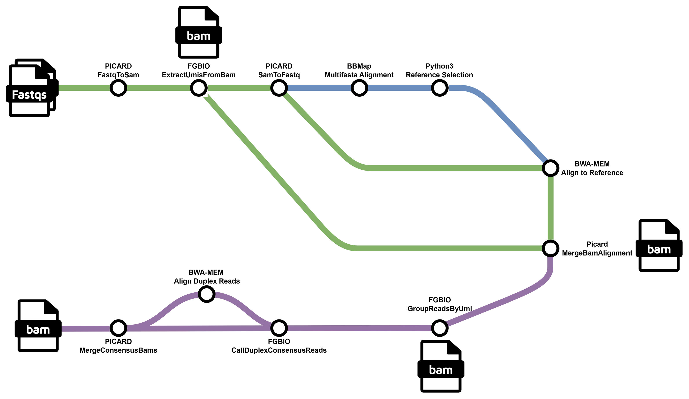

# BK-polyomavirus-WGS

[](https://dlmp.uw.edu/)
[](https://www.nextflow.io/)
[](https://www.nf-test.com)
[](https://github.com/uwvirology-ngs/BK-polyomavirus-WGS/actions/workflows/ci-tests.yml)
[](https://www.docker.com/)

## Description

Whole genome sequencing for BK polyomavirus

## Workflow



## Requirements

This pipeline is developed on Ubuntu 26.04 LTS with Nextflow v26.04.4+ and Docker v29.6.1+. 

Install [`Nextflow`](https://www.nextflow.io/docs/latest/install.html)

Install [`Docker`](https://docs.docker.com/engine/install/)

## Usage

### Run Test:

```bash
nextflow run main.nf \
    -params-file test.json
```

### Run Test (One Sample): 
```bash
nextflow run main.nf \
    -params-file test_single.json
```

### Run latest GitHub version on AWS:
```bash
NXF_VER=26.04.4 nextflow run uwvirology-ngs/bk-polyomavirus-wgs -r main -latest \
    --input your_samplesheet.csv \
    --output your_output_directory \
    -profile awsbatch \
    -c your_nextflow_aws.config
```

## CLI Options

### Required Parameters
| Parameter | About | Example |
|---------|---------|---------|
| `--input` | samplesheet | /assets/samplesheet.csv |

### Optional Parameters - Twist
| Parameter | About | Default |
|---------|---------|---------|
| `--output` | output directory | results |
| `--provide_ref` | whether to directly provide a reference | false |
| `--ref` | reference genome | null |

### Optional Parameters - Revica-strm
| Parameter | About | Default |
|---------|---------|---------|
| `--db` | multifasta database of reference genomes | /assets/bkv_multi.fa |
| `--ref_min_depth` | minimum sequencing depth | 3 |
| `--ref_min_cov` | minimum coverage | 30 |

## Acknowledgements

Reference selection logic incorporated from [revica-strm](https://github.com/epiliper/revica-strm) by the [Greninger Lab](https://github.com/greninger-lab).

## Contact

For feature suggestions and bug reports, please file an issue on the project [GitHub](https://github.com/aidantshea/nf_refvar-strict/issues).

For other inquiries, please reach out to aidants@uw.edu. 